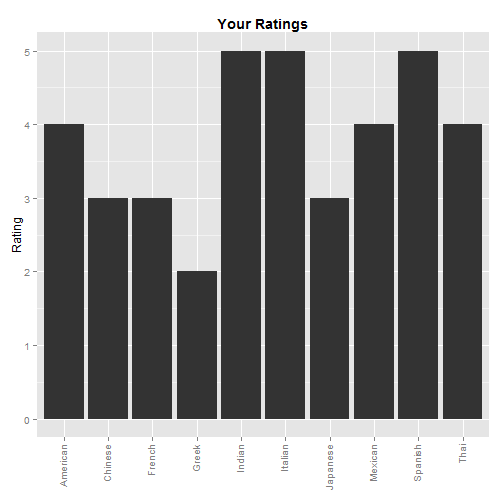
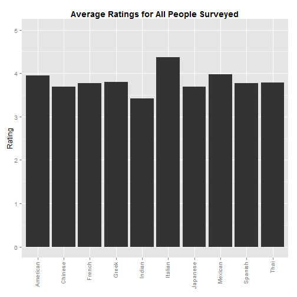
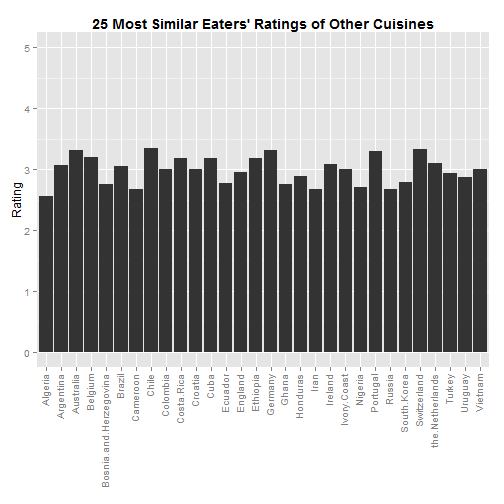

## Why?

Some people are hesitant to try foods that are unfamiliar to them. This app finds people with similar taste preferences to your own, and shows you how those people rate a wide diversity of cuisines. If people with similar tastes to your own seem to like a variety of food that you've never tried, maybe you should give it a shot!

--- .class #id 

## What kinds of food do you like?

A user answers a brief survey of how they rate the 9 [most popular](http://blogs.voanews.com/all-about-america/2015/05/18/top-10-most-popular-ethnic-cuisines-in-us/) ethnic cuisines in the United States, as well as American food itself. For example, a user could rate these cuisines as shown in the plot here:

 

---

## How does everyone else feel?

We'll then show you how all of the people in our dataset feel about those same 10 cuisines. We'll show a similar plot to the previous, but with the average ratings from the 1373 people who took the same survey:

 

---

## What other foods might you like?

Finally, we'll do some 'behind the scenes' calculations to find the 25 people in our database with taste preferences most similar to your own. We'll show you then how they rate a wide variety of cuisines from around the world. If you see a highly-rated food that you've never tried, give it a shot!

 

